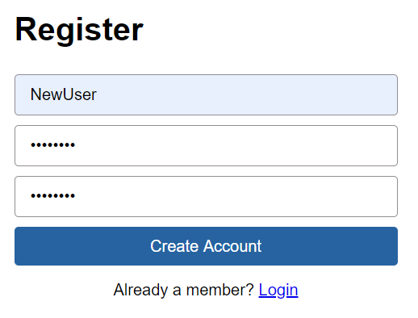
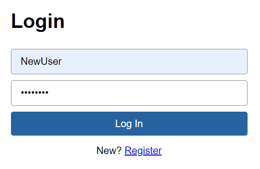
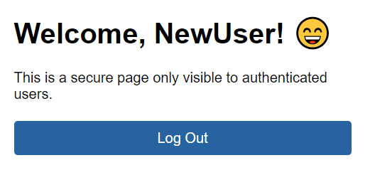

# Spring Boot Secure Application Stater
This project is meant to be a starting point for building a secure Spring Boot application.

## Tech
- Java 8
- MySQL 5.6
- Spring Boot 2.3

## Key Starter Features
- Protected app view
- Log in/out functionality
- User registration and validation
- Basic error handling 
- Basic role-based security

## Registration

## Login

## Protected App View

